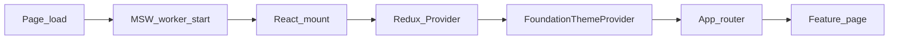
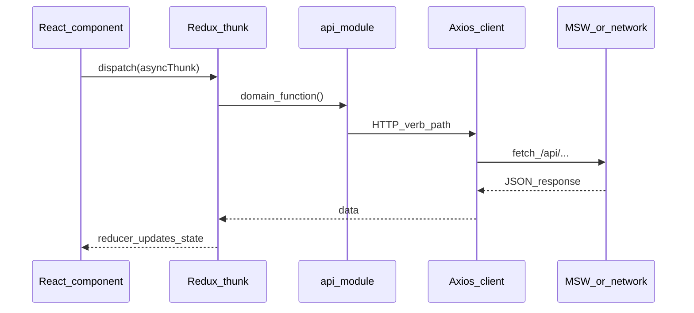

# Interics developer onboarding

This guide orients new contributors to the **Interics** front-end: a React single-page application (branded in the shell as **IDC Project Accounts**). It describes how the app boots, how data moves, where code lives, and what to touch when extending features.

---

## 1. Overview

### What this codebase does

Interics is a **browser-only** React app for project-centric accounting and operations: dashboard, projects (including creation flows and detail tabs), customers and vendors, finance (receivables, payables, expenses), compliance and tax (filing summary, GST, TDS, checklists), reports, documents, audit logs, user management, and settings.

The **canonical routing and navigation** live in [`src/App.tsx`](../src/App.tsx): React Router defines public routes (login, forgot password), protected routes, nested layouts, and sidebar structure via `navConfig`.

### Where it fits in the overall system

- **Client tier**: UI, client-side state (mostly Redux Toolkit), and HTTP calls through a shared Axios instance ([`src/api/client.ts`](../src/api/client.ts)).
- **API tier (optional in dev/deploy)**: Requests go to `VITE_API_URL` or default `/api`. [**Mock Service Worker (MSW)**](https://mswjs.io/) runs in the browser and intercepts those requests so the app can run **without a real backend**—including on static hosts (see [`src/main.tsx`](../src/main.tsx)).

There is no Node server in this repo; production builds are static assets (Vite).

---

## 2. High-Level flow

### In simple terms

1. The page loads and (when possible) starts a **service worker** that mocks APIs.
2. React mounts with **Redux**, **theme**, and the root **App** component.
3. If the user has a saved session in `localStorage`, the store **preloads** auth so they may skip login.
4. The **router** shows either auth pages or the main **app shell** (sidebar, top bar) and the **current screen**.
5. Screens load or change data by **dispatching Redux thunks**, which call **API modules**; results update the store and re-render the UI.

### In technical terms

1. [`enableMocking()`](../src/main.tsx) dynamically imports [`src/mocks/browser.ts`](../src/mocks/browser.ts), starts the MSW worker with handlers from [`src/mocks/handlers/index.ts`](../src/mocks/handlers/index.ts), then resolves.
2. `createRoot` renders `<Provider store={store}>` → [`FoundationThemeProvider`](../src/design-system/ThemeContext.tsx) → [`App`](../src/App.tsx).
3. [`App`](../src/App.tsx) wraps `BrowserRouter` → error boundary → `AppInner` with `Routes` / `Route`: `ProtectedRoute` checks `auth.user` and `auth.token`; nested routes render `AppShellLayout` with `Outlet` for feature pages.
4. Feature pages use [`useAppDispatch` / `useAppSelector`](../src/store/hooks.ts) and slice thunks; thunks use [`src/api/*.ts`](../src/api/) modules that call the shared Axios [`client`](../src/api/client.ts).

### Bootstrap sequence (mermaid)

### Request path (mermaid)

---

## 3. Core concepts / basics

| Concept | Role in this repo |
|--------|---------------------|
| **React 19 + Vite** | UI and bundling; dev server defaults to port **5174** ([`vite.config.ts`](../vite.config.ts)). Path alias `@` → [`src/`](../src/). |
| **Redux Toolkit (RTK)** | Single store in [`src/store/index.ts`](../src/store/index.ts). Domain folders under [`src/slices/`](../src/slices/) contain `reducer.ts` and usually `thunk.ts`. |
| **Typed hooks** | [`useAppDispatch` / `useAppSelector`](../src/store/hooks.ts) wrap react-redux with `RootState` and `AppDispatch` types. |
| **React Router 7** | Declarative routes, nested layouts, `Outlet`, `Navigate` redirects. Auth gate implemented as a wrapper route (`ProtectedRoute`) in [`App.tsx`](../src/App.tsx). |
| **Axios** | Shared instance with base URL, auth header, and 401 handling ([`src/api/client.ts`](../src/api/client.ts)). |
| **MSW** | `setupWorker` in [`src/mocks/browser.ts`](../src/mocks/browser.ts); handler arrays composed in [`src/mocks/handlers/index.ts`](../src/mocks/handlers/index.ts). |
| **MUI + Emotion** | Material UI components and styling ([`package.json`](../package.json)). |
| **Design system** | Shared UI under [`src/design-system/`](../src/design-system/) (theme, `AppShell`, primitives, charts, forms). |
| **Zustand** | Used for **toast** UI state only ([`src/design-system/components/feedback/Toast/useToast.ts`](../src/design-system/components/feedback/Toast/useToast.ts)); most app state remains Redux. |
| **TipTap** | Rich text editing (`@tiptap/*` packages). |
| **dayjs** | Dates (often with MUI X Date Pickers). |
| **Recharts** | Charts in the design system. |

**Architecture pattern**: **Feature folders** (`pages/`) + **vertical slices** (`slices/` + `api/`) + **presentation primitives** (`design-system/`). Templates for multi-step or full-page flows live under [`src/components/templates/`](../src/components/templates/).

**Note:** [`src/routes/AppRoutes.tsx`](../src/routes/AppRoutes.tsx) exists as an alternate layout of similar routes but **the running app wires routes in [`App.tsx`](../src/App.tsx)**. Treat `App.tsx` as the source of truth unless you intentionally migrate to `AppRoutes`.

---

## 4. File structure breakdown

Below is a **map of major areas**, not an exhaustive symbol list. Use your editor and tests to drill into individual files.

### Top-level

| Location | Purpose |
|----------|---------|
| [`src/main.tsx`](../src/main.tsx) | MSW bootstrap, React root, Redux `Provider`, theme provider. |
| [`src/App.tsx`](../src/App.tsx) | Router, `navConfig`, `AppShellLayout`, `ProtectedRoute`, error boundary, all route definitions. |
| [`vite.config.ts`](../vite.config.ts) | Vite config: `@` alias, dev port, `VITE_APP_VERSION` from `package.json`. |

### State and API

| Location | Purpose |
|----------|---------|
| [`src/store/index.ts`](../src/store/index.ts) | `configureStore`, reducer registration, **preloaded auth** from `localStorage`. |
| [`src/store/hooks.ts`](../src/store/hooks.ts) | Typed `useAppDispatch` / `useAppSelector`. |
| [`src/slices/`](../src/slices/) | One folder per domain: `reducer.ts`, `thunk.ts`, sometimes `types.ts`. Domains: **auth**, **customers**, **vendors**, **projects**, **pitch**, **baseline**, **users**, **roles**, **settings**, **categories**, **live**, **receivables**, **compliance**, **finance**, **transition**. |
| [`src/api/client.ts`](../src/api/client.ts) | Axios instance: `baseURL`, timeouts, **Bearer** token from `localStorage`, **401** response handling. |
| [`src/api/*.ts`](../src/api/) | Domain API functions (e.g. `projectsApi.ts`, `authApi.ts`)—**inputs/outputs** are the TypeScript signatures and return types of each exported function. |

### UI and pages

| Location | Purpose |
|----------|---------|
| [`src/pages/`](../src/pages/) | Route-level screens (Dashboard, Projects, Finance, Compliance, UserManagement, Settings, Auth, etc.). |
| [`src/design-system/`](../src/design-system/) | Theme, `AppShell`, navigation, form primitives, charts, feedback (including toasts). |
| [`src/components/`](../src/components/) | Cross-cutting feature components (e.g. expenses, vendor editors) and **templates** (`FullPageForm`, workspace layouts). |

### Mocks and assets

| Location | Purpose |
|----------|---------|
| [`src/mocks/browser.ts`](../src/mocks/browser.ts) | MSW worker export. |
| [`src/mocks/handlers/`](../src/mocks/handlers/) | Per-domain handler files; [`index.ts`](../src/mocks/handlers/index.ts) spreads them into one `handlers` array. |
| [`public/mockServiceWorker.js`](../public/mockServiceWorker.js) | MSW service worker file (generated/expected by MSW). |

### Config and utilities

| Location | Purpose |
|----------|---------|
| [`src/config/`](../src/config/) | App constants (e.g. billing rates). |
| [`src/utils/`](../src/utils/) | Shared helpers (data access, milestone/baseline helpers, etc.). |

---

## 5. Data flow

### Authentication

1. **Persistence**: [`src/store/index.ts`](../src/store/index.ts) reads `auth_token` and `ids_user` from `localStorage` at startup and **preloads** `auth` if both exist.
2. **Requests**: [`src/api/client.ts`](../src/api/client.ts) request interceptor reads `auth_token` and sets `Authorization: Bearer <token>`.
3. **Logout**: [`App.tsx`](../src/App.tsx) dispatches `logout` from the auth slice and navigates to `/login`.

### Feature data (typical path)

1. Component calls `dispatch(someThunk(arg))`.
2. Thunk uses a function from [`src/api/<domain>Api.ts`](../src/api/).
3. Axios returns JSON; thunk’s `fulfilled` handler maps into slice state in `reducer.ts`.
4. Component reads via `useAppSelector` and renders.

### Errors and session expiry

- Failed login does not necessarily clear storage; **401 with an existing token** triggers removal of `auth_token` and `window.location.href = '/dashboard'` in the client ([`src/api/client.ts`](../src/api/client.ts))—review this behavior when integrating a real backend.

---

## 6. Key logic and decisions

| Topic | What happens | Why it matters |
|-------|----------------|----------------|
| **MSW in production** | [`main.tsx`](../src/main.tsx) starts MSW before render; unhandled requests: dev **warn**, prod **bypass**. | Static deploys can demo the full UI without a server; bypass avoids breaking unknown URLs in prod. |
| **Protected routes** | `ProtectedRoute` requires `user` and `token` or redirects to `/login` with `state.from` ([`App.tsx`](../src/App.tsx)). | Central auth gate; deep links can restore `from` after login if pages implement it. |
| **Route order** | `/projects/create` is registered **before** `/projects/:id` ([`App.tsx`](../src/App.tsx)). | Prevents `:id` from capturing the literal `"create"`. |
| **App shell** | Logged-in routes nest under a pathless layout that renders `AppShell` + `Outlet`. | Single sidebar/topbar for most pages; demos can skip the shell via sibling routes. |
| **Preloaded Redux state** | Only `auth` is customized in `preloadedState`; other slices use reducers’ `initialState`. | Faster “remember me” UX; keep keys in sync with auth thunks/reducer. |

---

## 7. External dependencies

| Package | Role |
|---------|------|
| `react`, `react-dom` | UI runtime. |
| `react-router-dom` | Routing. |
| `@reduxjs/toolkit`, `react-redux` | Global state and async thunks. |
| `axios` | HTTP client. |
| `msw` | API mocking in the browser. |
| `@mui/material`, `@mui/icons-material`, `@mui/lab`, `@mui/x-date-pickers` | Components, icons, pickers. |
| `@emotion/react`, `@emotion/styled` | CSS-in-JS (MUI default). |
| `@tiptap/*` | Rich text editor. |
| `dayjs` | Date manipulation. |
| `recharts` | Charts. |
| `lucide-react` | Icons in app shell / nav ([`App.tsx`](../src/App.tsx)). |
| `zustand` | Toast store ([`useToast.ts`](../src/design-system/components/feedback/Toast/useToast.ts)). |
| `chroma-js` | Color utilities (theme/UI). |

Environment variable: **`VITE_API_URL`** overrides the Axios base URL ([`src/api/client.ts`](../src/api/client.ts)).

---

## 8. Edge cases / assumptions

| Assumption / risk | Detail |
|-------------------|--------|
| **MSW fails to start** | Catch block in [`main.tsx`](../src/main.tsx) logs a warning; `/api` calls may hit the static server and return HTML—hard to debug without Network tab. |
| **`localStorage` unavailable** | Private mode or policy blocks storage; persisted session and token attachment may fail. |
| **No backend + MSW off** | Unmocked requests fail or return non-JSON. |
| **401 handling** | Redirect uses `window.location.href`—full page reload; may reset in-memory state unexpectedly. |
| **Sidebar vs routes** | Some nav items are commented out in [`App.tsx`](../src/App.tsx); routes may still exist (e.g. documents, audit) without sidebar links. |

---

## 9. How to modify / extend

| Goal | Where to look |
|------|----------------|
| **New screen** | Add a component under [`src/pages/`](../src/pages/), register a `<Route>` in [`App.tsx`](../src/App.tsx), optionally extend `navConfig`. |
| **New API + state** | Add [`src/api/<name>Api.ts`](../src/api/), [`src/slices/<name>/`](../src/slices/) (reducer + thunk), register reducer in [`src/store/index.ts`](../src/store/index.ts), add MSW handlers in [`src/mocks/handlers/`](../src/mocks/handlers/) and export from [`index.ts`](../src/mocks/handlers/index.ts). |
| **Auth / every request** | [`src/api/client.ts`](../src/api/client.ts), [`src/slices/auth/`](../src/slices/auth/). |
| **Global theme / shell** | [`src/design-system/`](../src/design-system/), especially theme and `AppShell`. |

**Safer to edit**: New page folders, new slice folders, new handler files, feature-specific components.

**Higher risk**: [`src/api/client.ts`](../src/api/client.ts) (all HTTP behavior), [`src/store/index.ts`](../src/store/index.ts) (store shape and preload), root [`App.tsx`](../src/App.tsx) routing (ordering and layout), shared design-system primitives (wide blast radius).

---

## 10. Summary

Interics is a Vite-built React app that uses Redux for most state, Axios for HTTP, and MSW to mock APIs in the browser so you can develop and deploy without a backend. Entry is [`main.tsx`](../src/main.tsx) (MSW → Redux → theme → [`App.tsx`](../src/App.tsx)), which owns routing and the main shell. Domain logic is split across [`src/pages/`](../src/pages/), [`src/slices/`](../src/slices/), and [`src/api/`](../src/api/), with mocks mirroring API domains under [`src/mocks/handlers/`](../src/mocks/handlers/). When you add a feature, add API + slice + handlers + route, and keep global clients and store registration changes small and deliberate.
